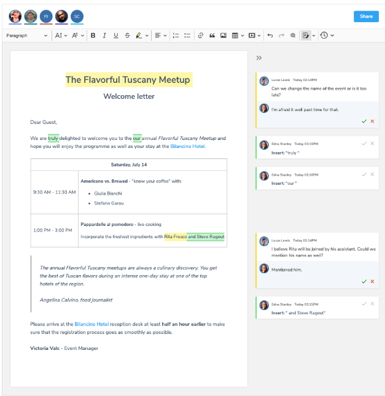

## Custon
omnia sub controllo sunt
-----------------------------------------------------------------------------------------------------------------
* #### Custon is a community that builds tools It is a non-payment community but pays on the reward (cash,bitcoin*money) of the work achieved
* #### We build different tools using our skills         
* #### AND WE WORK ON DIFFERENT AREAS TECH  (SOFWARE, WEB DEV, SYSTEM DEVELOPMENT AND TESTING, iNnOVATION NEW TECH)

#people concerned
-------------------------------------
* javascript,c++, C, Python, Java, Kotlin, Flutter programmers
* freelancer or employed 
* ML and AI learners 
* web developers, back-end, front-end
* Graphic designers and video editing
------------------------------------------------------------------------------------------------------------------

THIS PROJECT CONCERNED THIS 

web app for project management, team management, and communication with features like GitHub, chat, video calls, audio calls, and group calls, you can use various Node.js packages and libraries.
the application is built to rely on multiple users in one place eg: 10 users coding on the same codespace, 6 users discussing business strategy, 8 users sharing files, etc.

* # Example 1:
* 

technology that you may find
------------------------------

* Express.js: A fast, unopinionated, minimalist web framework for Node.js.

* Website: Express.js
* Socket.io: Enables real-time, bidirectional, and event-based communication.

* Website: Socket.io
* MongoDB or MySQL: Choose a database for storing project and user data.

* MongoDB: MongoDB
* MySQL: MySQL
* SQLite
* Mongoose (if using MongoDB): An elegant MongoDB object modeling tool.

* Website: Mongoose
* Passport.js: For authentication, it supports multiple strategies.

* Website: Passport.js
* JSON web token: For creating and verifying JSON Web Tokens (JWT).

* Website: jsonwebtoken
* bcrypt: A library for hashing and salting passwords.

* Website: bcrypt
* Express-validator: Middleware for validator.js validation library.

* Website: Express-validator
* Multer: For handling file uploads.

* Website: Multer
* Nodemailer: For sending emails.

* Website: Nodemailer
* WebRTC: For real-time communication, including video and audio.

* Website: WebRTC
* PeerJS: Simplifies WebRTC peer-to-peer data, video, and audio calls.

* Website: PeerJS
* RabbitMQ or Redis: For handling distributed messaging and tasks.

* RabbitMQ: RabbitMQ
* Redis: Redis
* GraphQL with Apollo Server: For efficient data fetching and manipulation.

* Apollo Server: Apollo Server
* React.js (Front-end): For building the user interface.

* React.js: React

* Python 
* c++
* c
* git
* Adobe (AI, Pr, An, XD, PS)

* Hosting: Heroku

